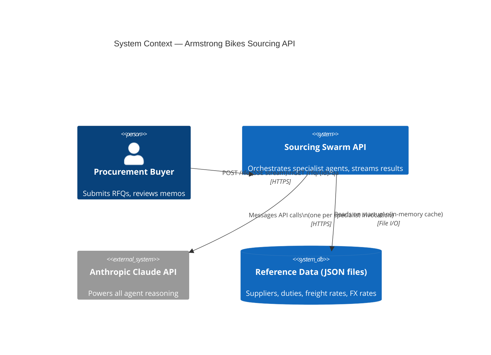
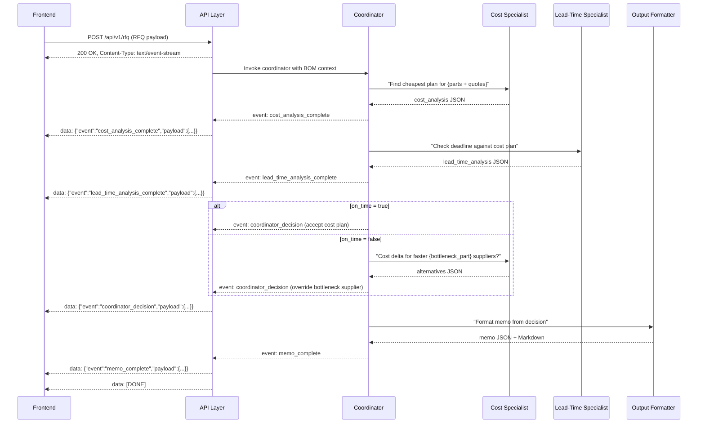
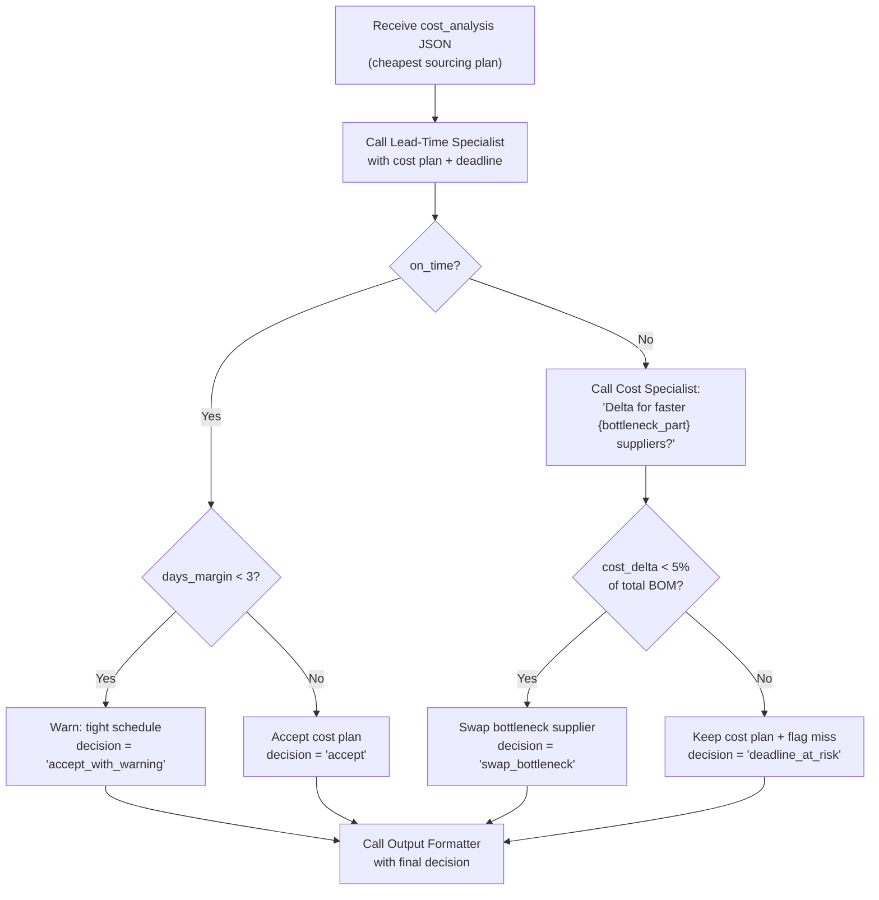

# Armstrong Bikes — Sourcing Swarm API Architecture

## Overview

A streaming REST API that wraps the four-skill sourcing swarm into a service callable by any frontend. The API accepts structured RFQ (Request for Quotation) payloads, pipes them through a coordinator-orchestrated specialist workflow, and streams intermediate results back to the client in real time. Completed memos can be queried conversationally via a dedicated Q&A endpoint.

---

## System Context



---

## Agent Architecture

The coordinator runs as the top-level agent. It does **not** call specialists directly as subprocess calls — each specialist is a separate Claude call with its own skill file loaded as context. The coordinator reads the specialists' JSON outputs and applies the decision logic documented in `bom-structure.md`.

```mermaid
flowchart TD
    FE["Frontend\n(structured RFQ)"]
    API["API Layer\n(FastAPI / Node)"]
    COORD["Coordinator Agent\nContext: bom-structure.md"]
    COST["Cost Specialist\nContext: cost-optimizer.md"]
    LT["Lead-Time Specialist\nContext: lead-time-critical-path.md"]
    FMT["Output Formatter\nContext: sourcing-recommendation.md"]
    QA["Q&A Agent\nContext: completed memo + skill files"]
    DB[("Reference Data\n(in-memory JSON)")]
    OUT["Streaming Response\n(SSE events)"]

    FE -->|POST /api/v1/rfq| API
    API --> COORD
    COORD -->|"1. Find cheapest plan"| COST
    COST -->|"cost_analysis JSON"| COORD
    COORD -->|"2. Check deadline"| LT
    LT -->|"lead_time_analysis JSON"| COORD
    COORD -->|"3. Conflict resolution\n(accept plan or swap bottleneck supplier)"| COORD
    COORD -->|"4. Format memo"| FMT
    FMT -->|"memo JSON + Markdown"| API
    API --> OUT

    DB -->|supplier quotes\nduty/freight/FX rates| COST
    DB -->|lead times\nbuffer strategy| LT

    FE -->|POST /api/v1/rfq/{id}/qa| API
    API --> QA
    QA -->|answer| API
```

---

## Streaming Event Flow

The API uses **Server-Sent Events (SSE)**. Each specialist publishes an event as it completes; the frontend can render partial results without waiting for the full pipeline.



---

## API Endpoints

### `POST /api/v1/rfq`
Submit a sourcing request. Returns an SSE stream.

**Request body:**
```json
{
  "rfq_id": "RFQ-005",
  "bike_model": "Commuter",
  "volume": 6000,
  "assembly_deadline_day": 30,
  "optimization_strategy": "greedy",
  "supplier_quotes": [
    {
      "part_name": "Frame",
      "supplier_id": "SUP_A",
      "unit_price": 18.00,
      "currency": "USD",
      "incoterm": "FOB",
      "lead_time_days": 28,
      "moq": 2000
    },
    {
      "part_name": "Wheels",
      "supplier_id": "SUP_C",
      "unit_price": 13.50,
      "currency": "USD",
      "incoterm": "CIF",
      "lead_time_days": 22,
      "moq": 5000
    }
  ]
}
```

**Fields:**
| Field | Type | Required | Description |
|---|---|---|---|
| `rfq_id` | string | No | Caller-supplied ID; auto-generated if omitted |
| `bike_model` | enum | Yes | `Commuter`, `Mountain`, or `Road` |
| `volume` | integer | Yes | Number of bikes to produce |
| `assembly_deadline_day` | integer | Yes | Day number from order placement (Day 0) by which assembly must be complete |
| `optimization_strategy` | enum | No | `greedy` (default), `consolidation`, or `balanced` |
| `supplier_quotes` | array | Yes | At least one quote per critical part (Frame required) |

**SSE events emitted:**
| Event | When | Payload |
|---|---|---|
| `rfq_started` | Immediately after validation | `{rfq_id, bike_model, volume}` |
| `cost_analysis_complete` | Cost specialist finishes | Full `cost_analysis` JSON (see cost-optimizer.md output schema) |
| `lead_time_analysis_complete` | Lead-time specialist finishes | Full `lead_time_analysis` JSON (see lead-time-critical-path.md output schema) |
| `coordinator_decision` | After conflict resolution | `{decision: "accept" \| "swap_bottleneck", bottleneck_part?, cost_delta?}` |
| `memo_complete` | Formatter finishes | `{json: {...}, markdown: "..."}` |
| `error` | Any pipeline failure | `{stage, message, recoverable}` |

---

### `GET /api/v1/rfq/{rfq_id}`
Retrieve a completed memo by ID (persisted in-memory until process restart).

**Response:**
```json
{
  "rfq_id": "RFQ-005",
  "status": "complete",
  "bike_model": "Commuter",
  "volume": 6000,
  "memo": {
    "json": { ... },
    "markdown": "# Sourcing Recommendation Memo\n..."
  },
  "cost_analysis": { ... },
  "lead_time_analysis": { ... },
  "coordinator_decision": { ... },
  "tokens_used": {
    "cost_specialist": 850,
    "lead_time_specialist": 620,
    "coordinator": 400,
    "formatter": 310,
    "total": 2180
  },
  "cost_per_decision_usd": 0.056,
  "completed_at": "2026-08-25T14:32:00Z"
}
```

---

### `POST /api/v1/rfq/{rfq_id}/qa`
Ask a follow-up question about a completed sourcing memo.

**Request body:**
```json
{
  "question": "Why was Shanghai Steel chosen for the frame over the Taiwan supplier?"
}
```

**Response:**
```json
{
  "rfq_id": "RFQ-005",
  "question": "Why was Shanghai Steel chosen for the frame over the Taiwan supplier?",
  "answer": "Shanghai Steel was selected because its landed cost of $17.26/unit is $2.24 cheaper than the Taiwan alternative at $19.50/unit, and the 28-day lead time was sufficient to meet the Day 30 assembly deadline with a 2-day margin. The coordinator only overrides cost when the deadline cannot be met; in this case, it could.",
  "tokens_used": 280
}
```

The Q&A agent loads the completed `cost_analysis`, `lead_time_analysis`, `coordinator_decision`, and the full text of all four skill files as context before answering.

---

### `GET /api/v1/suppliers`
List all suppliers in the in-memory reference database.

**Response:**
```json
{
  "suppliers": [
    {
      "supplier_id": "SUP_A",
      "name": "Shanghai Steel",
      "country": "China",
      "parts": ["Frame"],
      "lead_time_days": 28,
      "default_incoterm": "FOB",
      "risk_profile": "medium"
    }
  ]
}
```

---

### `GET /api/v1/health`
Returns `200 OK` with service status and reference data load confirmation.

---

## Reference Data Layer

The API loads all reference tables from JSON files at startup into an in-memory store. No database process is required.

```
data/
  suppliers.json       ← Supplier master (derived from supplier_master.csv)
  duty_rates.json      ← Import duty by HS code and origin country
  freight_rates.json   ← Freight cost by route (origin → LA) and mode (sea/air)
  fx_rates.json        ← Fixed exchange rates (CNY, EUR, VND, JPY → USD)
```

These files need to be created. The schema for each:

**`data/suppliers.json`**
```json
[
  {
    "supplier_id": "SUP_A",
    "name": "Shanghai Steel",
    "country": "CN",
    "parts": ["Frame"],
    "lead_time_days": 28,
    "default_incoterm": "FOB",
    "moq": 2000,
    "price_by_part": { "Frame": 18.00 },
    "currency": "USD",
    "risk_tier": 2
  }
]
```

**`data/duty_rates.json`**
```json
[
  { "part_category": "Frame", "material": "steel", "duty_rate": 0.025 },
  { "part_category": "Frame", "material": "carbon", "duty_rate": 0.00 },
  { "part_category": "Wheels", "duty_rate": 0.025 },
  { "part_category": "Drivetrain", "duty_rate": 0.00 },
  { "part_category": "Brakes", "duty_rate": 0.026 },
  { "part_category": "Handlebars", "duty_rate": 0.025 },
  { "part_category": "Cables", "duty_rate": 0.025 }
]
```

**`data/freight_rates.json`**
```json
[
  { "origin": "CN", "destination": "LA", "mode": "sea", "cost_per_unit": 0.21, "transit_days": 21 },
  { "origin": "TW", "destination": "LA", "mode": "sea", "cost_per_unit": 0.19, "transit_days": 18 },
  { "origin": "VN", "destination": "LA", "mode": "sea", "cost_per_unit": 0.18, "transit_days": 20 },
  { "origin": "CN", "destination": "LA", "mode": "air",  "cost_per_unit": 1.25, "transit_days": 5 }
]
```

**`data/fx_rates.json`**
```json
{
  "base": "USD",
  "as_of": "2026-08-22",
  "rates": {
    "CNY": 0.138,
    "EUR": 1.085,
    "VND": 0.0000394,
    "JPY": 0.00667
  }
}
```

---

## Coordinator Decision Logic

The coordinator implements the following decision tree, derived from `bom-structure.md` and `lead-time-critical-path.md`:



---

## Project File Layout (To Be Created)

```
armstrong_bikes/
├── API_ARCHITECTURE.md          ← This file
├── bom-structure.md             ← Skill: bike parts encyclopedia
├── cost-optimizer.md            ← Skill: landed cost calculator
├── lead-time-critical-path.md   ← Skill: critical path analyzer
├── sourcing-recommendation.md   ← Skill: memo formatter
├── incoterm_rules.md            ← Reference: incoterm cost allocation
│
├── data/                        ← Reference data (populate before running)
│   ├── suppliers.json
│   ├── duty_rates.json
│   ├── freight_rates.json
│   └── fx_rates.json
│
├── src/
│   ├── main.py                  ← FastAPI app, route definitions
│   ├── agents/
│   │   ├── coordinator.py       ← Coordinator agent logic + decision tree
│   │   ├── cost_specialist.py   ← Wraps cost-optimizer.md Claude call
│   │   ├── lead_time_specialist.py ← Wraps lead-time-critical-path.md Claude call
│   │   ├── output_formatter.py  ← Wraps sourcing-recommendation.md Claude call
│   │   └── qa_agent.py          ← Q&A agent for completed memos
│   ├── data/
│   │   └── loader.py            ← Loads JSON reference files into memory at startup
│   ├── models/
│   │   ├── rfq.py               ← RFQ request/response Pydantic models
│   │   └── memo.py              ← Memo Pydantic models (mirrors skill output schemas)
│   └── streaming/
│       └── sse.py               ← SSE event emitter utilities
│
└── tests/
    ├── test_cost_specialist.py  ← Unit tests using scenarios from SKILLS_README.md
    ├── test_lead_time_specialist.py
    └── test_coordinator.py      ← Integration tests for conflict resolution scenarios
```

---

## Key Design Decisions

| Decision | Choice | Rationale |
|---|---|---|
| Agent invocation | Separate Claude API call per specialist | Keeps each specialist's context window clean; matches the skill file design |
| Streaming protocol | SSE (not WebSocket) | Unidirectional stream is sufficient; simpler to implement and proxy |
| Data persistence | In-memory only | Matches "simple in-memory database reading from JSON files"; add a DB layer later if needed |
| Q&A context | Full memo + all 4 skill files | Q&A agent needs to explain *why* the coordinator decided as it did, which requires the skill context |
| Output formats | JSON + Markdown | JSON for machine consumption; Markdown for web UI rendering |
| Conflict threshold | 5% of total BOM cost | Documented in BIKE_SOURCING_SUMMARY.md coordinator pseudocode; expose as a config param |

---

## Open Items (Need Data Files)

The following files are referenced in the docs but not present in the repo. They must be created before the API can run:

- `data/suppliers.json` — Schema above; seed from `supplier_master.csv` inside `bike-sourcing-skills.zip`
- `data/duty_rates.json` — Seed from `duty_rates.csv`
- `data/freight_rates.json` — Seed from `freight_rates.csv`
- `data/fx_rates.json` — Seed from `fx_rates.csv`
- `data/eval_dataset.jsonl` — 40 RFQs for evaluating agent accuracy (from the zip)
